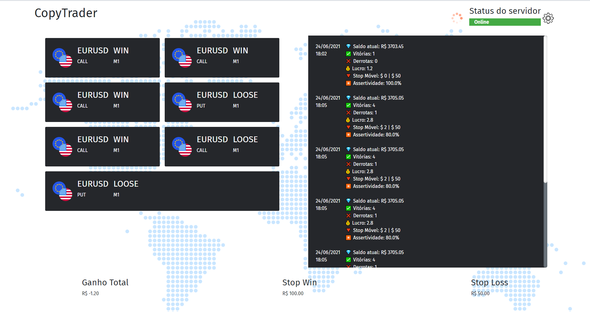
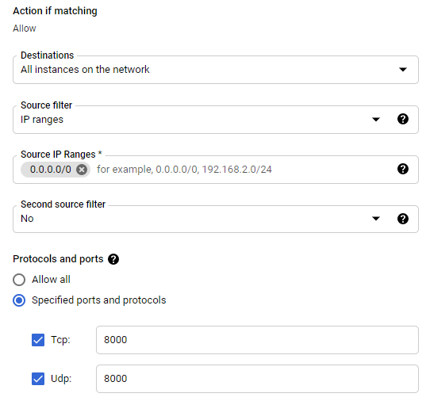
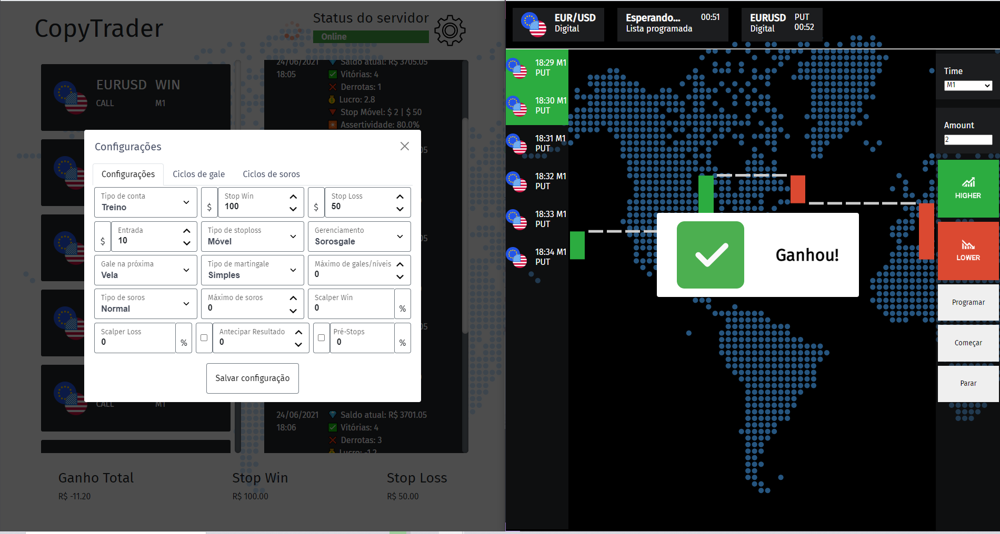

# CopyTrader for IQ Option

> An copytrader for IQ platform where the ADM sends trades to their clients



## Version 1 - Google Cloud Platform
> Using Google Cloud VM to host a simple server that provides the communication between client-server.

### Setup

1. Creating and cloning the project
    1. Create a Ubuntu VM on Google Cloud
    2. Clone the project
2. Setuping the VM
    1. Create a new FireWall rule at VPC Network
    2. Follow this configuration:
        
    3. Turn on the Cloud Shell and 
        ```bash
        sudo apt-get install ufw
        sudo ufw enable
        sudo ufw allow ssh
        sudo ufw allow 8000
        ```
3. Start the server
    1. Start the server script with:
        ```bash
        python3 server.py
        ```
    2. get the extenal ip
    3. make the requests to this ip address
    4. To start forever:
        ```bash
        screen -dmS server python3 server.py
        ```

### Important links
[Simple Python 3 HTTP server for logging all GET and POST requests](https://gist.github.com/mdonkers/63e115cc0c79b4f6b8b3a6b797e485c7)

[How to access Google Cloud Engine instance's IP address via browser](https://stackoverflow.com/questions/36758460/how-to-access-google-cloud-engine-instances-ip-address-via-browser/51437065#51437065)

## Version 2 - DontPad "database"
> Using the dontpad web site, the bot writes and read json texts from this free web site, not being necessary to use GCloud

### Setup
Modify the "id" field in the config/data.json file, using the same word to "connect" the client to the controller. So generate a generator license using the gerador.py, and with the license file you can generate the new license file for the bots.


